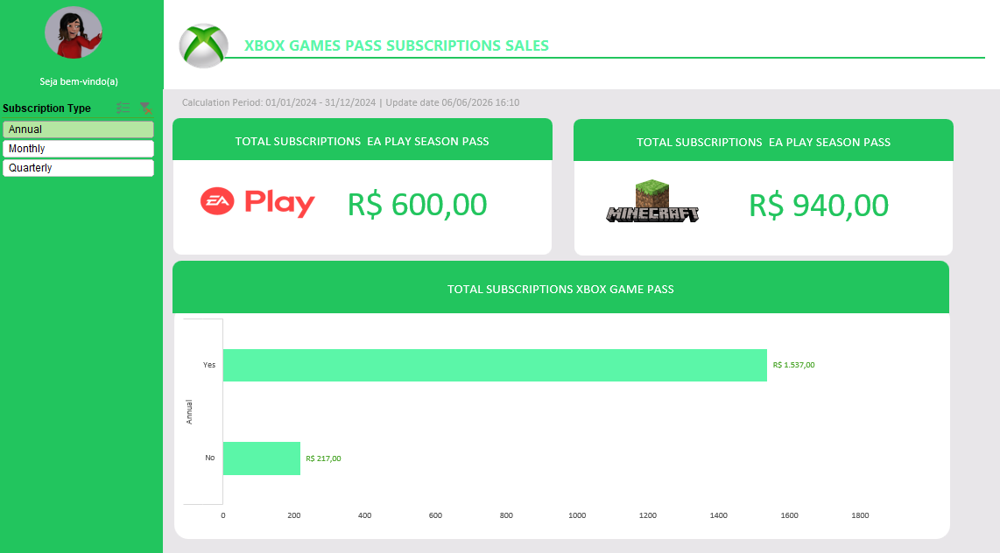

# 🎮 Xbox Game Pass Subscriptions Sales Dashboard

## 📌 Sobre o Projeto

Este projeto foi desenvolvido como parte de um desafio de análise de dados utilizando o Microsoft Excel. O objetivo foi transformar dados brutos de vendas em informações visuais claras e estratégicas por meio da criação de um dashboard interativo.

O dashboard permite analisar o desempenho das vendas de assinaturas do Xbox Game Pass, identificar padrões de consumo, acompanhar produtos complementares e comparar o faturamento de assinaturas com e sem renovação automática.

---

## 🎓 Contexto do Projeto

Este projeto foi desenvolvido com base nos conhecimentos adquiridos durante o bootcamp **TOTVS - Fundamentos de Engenharia de Dados e Machine Learning**, oferecido pela DIO (Digital Innovation One).

O desafio teve como objetivo aplicar conceitos de análise de dados, organização de informações e construção de dashboards utilizando Microsoft Excel, transformando dados brutos em indicadores visuais capazes de apoiar a tomada de decisões.

Durante o desenvolvimento foram praticados conceitos relacionados a:

- Análise e interpretação de dados;
- Construção de dashboards interativos;
- Tabelas Dinâmicas;
- Gráficos Dinâmicos;
- Segmentação de Dados (Slicers);
- Visualização de dados;
- Boas práticas de organização e apresentação de informações.

---

## 🎯 Objetivo

Criar um dashboard de vendas capaz de fornecer insights relevantes para o negócio, auxiliando na análise de desempenho e na tomada de decisões baseada em dados.

---

## 📊 Perguntas de Negócio

O dashboard foi desenvolvido para responder às seguintes questões:

### 1. Faturamento Total dos Planos Anuais

Qual o faturamento total das vendas de planos anuais, considerando todas as assinaturas agregadas?

### 2. Auto Renovação vs Não Auto Renovação

Qual o faturamento total das vendas de planos anuais separado entre assinaturas com auto renovação e sem auto renovação?

### 3. Vendas do EA Play

Qual o faturamento total das assinaturas do EA Play?

### 4. Vendas do Minecraft Season Pass

Qual o faturamento total das assinaturas do Minecraft Season Pass?

---

## 📈 Funcionalidades do Dashboard

- Filtro interativo por tipo de assinatura:
  - Annual
  - Monthly
  - Quarterly

- Indicadores de faturamento para:
  - EA Play
  - Minecraft Season Pass

- Comparação visual entre:
  - Assinaturas com Auto Renewal
  - Assinaturas sem Auto Renewal

- Dashboard com layout inspirado na identidade visual do Xbox.

---

## 🛠️ Ferramentas Utilizadas

- Microsoft Excel
- Tabelas Dinâmicas
- Gráficos Dinâmicos
- Segmentação de Dados (Slicers)
- Formatação Condicional
- Organização e Tratamento de Dados
- Design de Dashboards

---

## 📂 Estrutura da Planilha

### Assets

Armazena os elementos visuais utilizados no projeto, como imagens, logos e ícones.

### Bases

Contém a base de dados original utilizada para a construção das análises.

### Cálculos

Responsável pelos cálculos auxiliares, métricas e Tabelas Dinâmicas que alimentam o dashboard.

### Dashboard

Painel principal com os indicadores, filtros e visualizações desenvolvidas para responder às perguntas de negócio.

---

## 📂 Estrutura do Repositório

```text
📁 Sales_dashboard_challenge_in_Excel
│
├── base.xlsx
├── dashboard_xbox.xlsx
├── README.md
└── assets/
    └── dashboard.png
```

---

## 🚀 Como Utilizar

1. Faça o download do arquivo Excel disponível neste repositório.
2. Abra o arquivo utilizando o Microsoft Excel.
3. Acesse a aba **Dashboard**.
4. Utilize os filtros disponíveis para explorar diferentes cenários.
5. Analise os indicadores e gráficos para obter insights sobre as vendas.

---

## 📸 Dashboard

Adicione nesta seção uma captura de tela do dashboard final.

markdown



---

## 📚 Aprendizados

Durante o desenvolvimento deste projeto foram aplicados conceitos importantes de análise de dados e Business Intelligence, tais como:

- Construção de dashboards executivos;
- Transformação de dados em informações estratégicas;
- Utilização de Tabelas Dinâmicas;
- Criação de Gráficos Dinâmicos;
- Uso de Segmentação de Dados;
- Organização visual de indicadores;
- Desenvolvimento de relatórios para apoio à tomada de decisão.

---

## 🙏 Créditos

Projeto desenvolvido como parte do bootcamp **TOTVS - Fundamentos de Engenharia de Dados e Machine Learning**, promovido pela DIO (Digital Innovation One).

Agradecimentos à DIO e à TOTVS pela disponibilização do conteúdo, materiais de apoio e desafios práticos que possibilitaram a aplicação dos conceitos estudados.

---

**Roberto Sulkovski**

GitHub: https://github.com/robertosulkovski

LinkedIn: https://www.linkedin.com/in/roberto-sulkovski-roxo

---

## 📄 Licença

Este projeto foi desenvolvido para fins educacionais como parte de um desafio prático de análise de dados utilizando Microsoft Excel.
